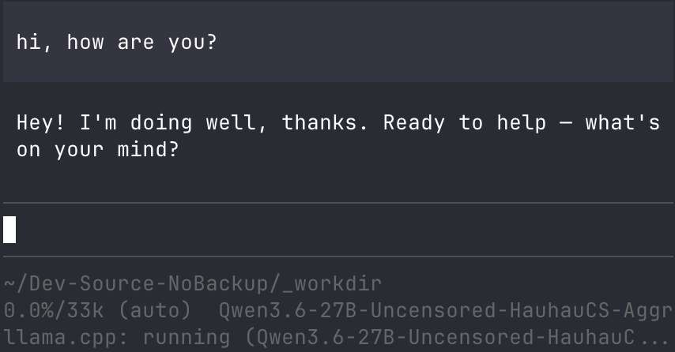
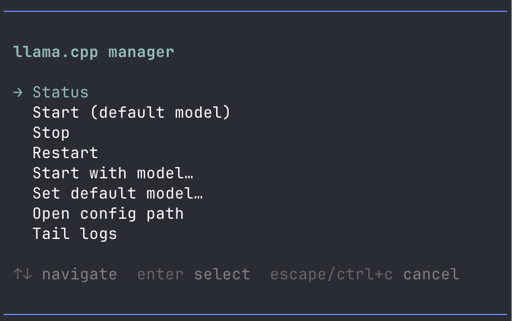

# pi-llama-manager

Pi extension for managing a local `llama-server` process and selecting GGUF models.

## Features

- `/llama` interactive menu
- `/llama status|start|stop|restart` command variants
- Model picker from local GGUF files
- Prevents accidental second `llama-server` instance
- Filters out `mmproj-*.gguf` projector files from model list
- Stable tool-calling defaults for Qwen/llama.cpp workflows

## Screenshots





## Requirements

- Pi coding agent with extension support
- `llama-server` (from `llama.cpp`) available in `PATH`
- At least one local GGUF model file
- A writable `~/.pi/agent/` directory

## Install

### From GitHub

```bash
pi install https://github.com/benedict2310/pi-llama-manager
```

### Or via settings

```json
{
  "packages": [
    "https://github.com/benedict2310/pi-llama-manager"
  ]
}
```

## Usage

```text
/llama
/llama status
/llama start
/llama stop
/llama restart
/llama start /absolute/path/to/model.gguf
```

## Configuration

On first use, the extension creates:

- `~/.pi/agent/llama-manager.json`

Example:

```json
{
  "host": "0.0.0.0",
  "port": 8080,
  "modelsRoots": ["/Users/you/models"],
  "defaultModelPath": "",
  "logFile": "/Users/you/.pi/agent/llama-server.log",
  "stableToolCalling": true,
  "defaultArgs": {
    "jinja": true,
    "reasoning": "off",
    "chatTemplateKwargs": { "enable_thinking": false },
    "temp": 0.2,
    "topP": 0.9
  },
  "extraArgs": []
}
```

## Test

```bash
npm test
```

## Notes

- If the requested model is already running, start returns success/info instead of error.
- If a different model is running, use restart to switch models.
